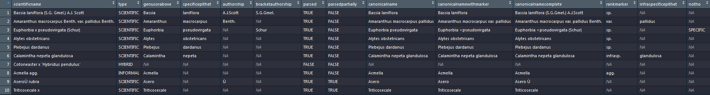

# Getting started

- First, click on this [invitation link](https://classroom.github.com/a/eXxaGERa) in order to copy _checklist-recipe_  on your account as *checklist-recipe-your_github_username*. You will be automatically redirected to the home page of this repository. 
- Open RStudio
- Click on tab `File` -> `New Project`
- Choose `Version Control` -> `Git`
- Fill `Repository URL` in with the URL of the just created repository. It should be something like this `https://github.com/username/checklist-username` where `username` stays for your GitHub username. The `Project directory name` will be authomatically filled in as `checklist-yourusername` 
- Choose the folder where you would like to create the subfolder containing the project's folder


# Exercise vs working mapping template

There are two RMarkdown files in `./src`:

1. an exercise, `exercise.Rmd`
2. a working mapping template, `dwc_mapping.Rmd`

You can use the template as a kind of _cheatsheet_ to solve the exercise. Eventually you can run the entire `dwc_mapping.Rmd` to go through all mapping steps at once (`Ctrl` + `Alt` + `R`) or one by one (`Ctrl`+ `Shift` + `Enter`).

# Mapping steps

## Setup

Install packages:

```r
install.packages("tidyverse")
```

Load packages:

```r
library(tidyverse)
```

# Read source data

The checklist template is an Excel file (`./data/raw/checklist.xlsx`). The import specifications for Excel files are more limited than those for delimited files (`csv`, `tsv`, `txt`). However, we use Excel here as this format is often used to manage datasets. To import Excel files, you can use the `read_excel()` function from the package readxl(), where you specify the path to the xlsx file. **maybe some more information about how to define the path here**. The raw data file is imported as the dataframe `input_data`.

```
input_data <- read_excel(path)
```

The very first step is to inspect whether the checklist has been imported correctly. The function `head()` returns the first lines of the dataframe. In this example the code returns the first five lines:

```
input_data %>% head(n = 5)
```

# Process source data

Befor we start mapping to Darwin Core, `input_data` needs to be cleaned and transformed somewhat. This recipe includes the following steps:

- Clean rows and columns
- Screen all scientific names for potential errors using the [GBIF nameparser](https://www.gbif.org/tools/name-parser)
- Retrieve and add nomenclatural information
- Add taxonRank information
- Generate taxonID

## Rows and columns

Your checklist should be tidy. Concretely, this implies that:

1. Each variable forms a column.
2. Each observation forms a row.
3. Each type of observational unit forms a table.

The provided checklist template is a good example of a tidy dataset. For more information on tidy datasets, click [here](http://vita.had.co.nz/papers/tidy-data.html). Starting with untidy data will make the mapping script a lot more complex, with many preparatory steps before you can even start mapping. In a tidy dataset, you should be able to start the mapping immediately. However, in some cases, some small cleaning steps could be required, such as removing empty rows. For this, we use the function `remove_empty()` from the package janitor. It removes all rows from the dataframe that are composed entirely of empty values.

```
input_data %<>% remove_empty("rows")
```

More cleaning steps could be necessary, but are out of scope for this checklist recipe. 
LR: refer to some good tutorials/websites here?

During the mapping, we will sequentially add new Darwin Core terms (see further). To avoid name clashes between the original columns in raw_data and the added Darwin Core columns, we add the prefix `input_` to the column names of raw_data (LR: integrate link)

### Retrieve nomenclatural information

The full scientific name of a species could be lengthy (e.g. `Bassia laniflora (S.G. Gmel.) A.J. Scott`). Mistakes could easily be made when entering the names in the template. One way to screen for potential errors is by using the [GBIF nameparser](https://www.gbif.org/tools/name-parser). It disects the scientific name in its different components and checks them against the taxonomic backbone used by GBIF. 


The following information returned by the nameparser function indicates that the scientific name could be correct:

- type = "SCIENTIFIC" AND
- parsed = "TRUE" AND
- parsedpartially = "FALSE"

Information deviating from these criteria could imply that the scientific name is incorrect. 

The "type" field indicates whether or not the scientific name is truly scientific (type = "SCIENTIFIC") or e.g. whether it is not a scientificname of any kind (type = `NO_NAME`). Important to note is that the nameparser not necessarily detects all incorrect scientific names, it just gives you a good idea about which ones could be wrong. 

The `parsed` and `parsedpartially` field indicates whether or not the name parser has parsed the full scientific name, which is not alwas the case. This could be due to spelling errors or when taxonomic, nomenclatural or identification notes are added to the end of the name. In these cases the name will only be parsed partially (parsedpartially = "TRUE") or not at all (parsed = "FALSE").
When a scientific name was not parsed at all

In the checklist recipe, we apply the nameparser function to `input_scientific_names` and screen for possbile errors. We specifically select the scientific names deviating from the abovementioned criteria by using the following filtering function:

```
filter(!(type == "SCIENTIFIC" & parsed == "TRUE" & parsedpartially == "FALSE"))
```

This renders the following output:


Here, the output indicates that `Acmella agg.` is a scientific name with some informal addition (type = "INFORMAL"). The decision whether or not to implement changes for this name is up to the author of the checklist. In this example, we decided to leave the scientific name unchanged.
In the case of the species `AseroÙ rubra`, the nameparser indicates that it was parsed only partially. This is due to a spelling error, i.e. the species name should be `Asero rubra`. There are two options to correct the scientific name in this case: 

- COrrect the scientific name in the raw data file (recommended)
- apply a cleaning function in R

Although we recommend to clean the scientific name in the [raw data file](), we here provide an [example] on how to clean the scientifc name by applying the recode() function provided by the package `dplyr`.

```
input_data %<>% mutate(variable = recode(variable,
  "scientific_name_after_cleaning" = "scientific_name_before_cleaning"
))
```

In this example, the variable is `input_scientific_name`, the scientific_name_before_cleaning is `"AseroÙ rubra"`, the scientific_name_before_cleaning is `"Asero rubra"`.


The simplest way for a quick overview of the raw data is by using the functions `head()` and `str()`: 

```r
head(raw_data) # Displays the first 6 lines of the dataframe
```

```r
str(raw_data) # Displays the structure of the dataframe
```

During the mapping, we will sequentially add new Darwin Core terms (see further). To avoid name clashes between the original columns in `raw_data` and the added Darwin Core columns, we add the prefix `raw_` to the column names of `raw_data`:

```r
colnames(raw_data) <- paste0("raw_", colnames(raw_data))
```

```r
colnames(raw_data)
```

## Create taxon core

Even though `raw_data` contains all necessary information in a single data frame, a Darwin Core Archive might consist of multiple files, e.g. a core and extensions. We recommend to create the core file first and then the extensions.

The mapping process is **sequential**: we add the Darwin Core terms step by step. The Darwin Core terms for each core/extension file can be found on the [GBIF Resources page](http://rs.gbif.org/):

[](http://rs.gbif.org)

It is good practice to inspect the Darwin Core terms on this webpage one by one to see whether a particular term can be used in your checklist. It's good practice to respect the order of the terms as they listed on the GBIF resource page.

The Darwin Core terms for the taxon core can be found on the [GBIF Resources Taxon Core page](http://rs.gbif.org/core/dwc_taxon_2015-04-24.xml). Typical terms are: `scientificName`, `kingdom` and `taxonRank`.

## Create distribution extension

Many checklists contain information related to species distribution. The Darwin Core terms for the distribution extension can be foud on the [GBIF Resources Species Distribution page](http://rs.gbif.org/extension/gbif/1.0/distribution.xml). Species distribution contains typically:

- Geographical information, `locality` (e.g. _Bariloche, 25 km NNE via Ruta Nacional 40 (=Ruta 237)_), `countryCode` (e.g. _US_, _BE_, _FR_)
- Information about how frequent the species occurs, `occurrenceStatus` (e.g. _present_, _rare_, _absent_)
- Threat status as defined by IUCN, `threatStatus` (e.g. _EX_, _EW_, _CR_)
- Description whether the organism occurs natively, is introduced or cultivated, `esatblishmentMeans` (e.g. _introduced_)

# Different types of mapping

There are manily three different types of mapping:

1. Mapping static fields (static values)
2. Mapping fields as is (unaltereted values)
3. Recoding fields (altered valus)

## Mapping static fields

Static values are used for Darwin Core terms that need the same value for all records. Most often, they are absent in `raw_data`. This mostly concerns metadata fields in the taxon core file as _dataset name_, _language_, _license_ and _rights holder_. 

## Mapping fields as is

Unaltered values are used for Darwin Core terms for which the content is an exact copy of the corresponding field in `raw_data`. Before deciding whether or not some basic processing is required, it is useful to screen the variables in `raw_data` for their specific content. `distinct()` is a useful function to show the unique values for a field:

```r
taxon %>% distinct(raw_kingdom)
```

An example:

```r
taxon %<>% mutate(scientificName = raw_species)
```

## Recoding fields

Altered values are used for Darwin Core terms for which the content in `raw_data` is used as a basis, but it needs to be standardized. This applies to Darwin Core terms for which we use a [vocabulary](http://rs.gbif.org/vocabulary/gbif/) or where we want to transform for clarity or to correct obvious mistakes. 

The main functions we use for these are: `mutate()` + `recode()` or  `mutate()` + `case_when()`.

### `mutate()` + `recode()`

In this case, we aim to replace specific information in `raw_data` by new information specified in the code.

_Add basic example based on template!!!_

### `mutate()` + `case_when()`

`case_when` is often used together with `mutate()` when you want to make a new column (or change an existing one) based on the content of other existing variables.

_Add basic example based on template!!_

# Push changes to GitHub

You would eventually like to _save_ your mapping not only locally on your computer, but remotely on GitHub too. You have then to _commit_ your work and  _push_ it to GitHub. Doing so, you will sync the GitHub repository with the most updated version on your local machine.

You can do it within RStudio: [hands-on session within RStudio](https://inbo-tutorials.netlify.com/git/rstudio/#/), or you can alternatively use GitHub Desktop: [hands-on session with GitHub Desktop](https://inbo-tutorials.netlify.com/git/desktop/#/).

# Using IPT to publish

GBIF provides an Integrated Publishing Toolkit (IPT) in order to check your checklist and eventualy publish it on GBIF. Follow the guideline as provided by GBIF: [How To Prepare Your IPT Server](https://github.com/gbif/ipt/wiki/IPTServerPreparation.wiki). You will likely have to install a servlet as Tomcat and setup a virtual host name. If you are member of an organization, contact first your IT team.

# Examples

Based on this recipe we were able to publish several checklists on GBIF. Some examples:

1. [Checklist of non-native freshwater fishes in Flanders](https://trias-project.github.io/alien-fishes-checklist/)
2. [Inventory of alien macroinvertebrates in Flanders, Belgium](https://github.com/trias-project/alien-macroinvertebrates)
3. [Catalogue of the Rust Fungi of Belgium](https://github.com/trias-project/uredinales-belgium-checklist)

Feel free to use the provided documentation as additional learning material.
