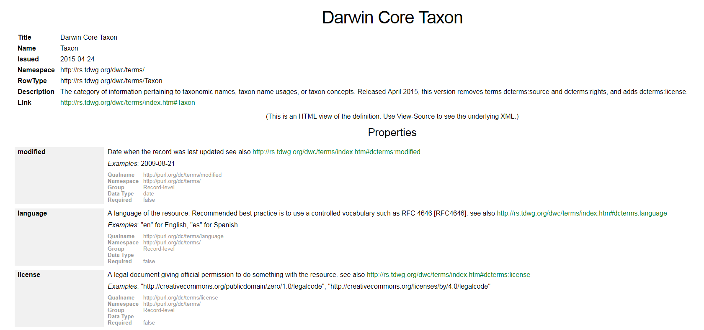

# Getting started

- First, click on this [invitation link](https://classroom.github.com/a/eXxaGERa) in order to copy _checklist-recipe_  on your account as *checklist-recipe-your_github_username*. You will be automatically redirected to the home page of this repository. 
- Clone the repository locally
- Open `./src/src.Rproj` in RStudio

# Exercise vs working mapping template

There are two RMarkdown files in `./src`:

1. an exercise, `exercise.Rmd`
2. a working mapping template, `dwc_mapping.Rmd`

You can use the template as a kind of _cheatsheet_ to solve the exercise. Eventually you can run the entire `dwc_mapping.Rmd` to go through all mapping steps at once (`Ctrl` + `Alt` + `R`) or one by one (`Ctrl`+ `Shift` + `Enter`).

# Mapping steps

## Read and inspect data

### Read data

Our raw dataset is an Excel file (`./data/raw/checklist.xlsx`). The import specifications for Excel files are more limited than those for delimited files (`csv`, `tsv`, `txt`). However, we think it's useful to use Excel as a format in this exercise as this is often used to manage datasets.

1. Go to `Environment` panel: `Import dataset > From Excel...`
2. For `File/URL`, click `Browse` and select `checklist.xls`
3. Specify the `Import Options`:
    * `Name`: `raw_data`
    * `Sheet`: `checklist`
    * `NA`: `NA` or leave empty
    * `First Row as Names`: check
4. Click on `Data preview` to verify if everything looks OK
5. Click `Import` to generate the dataframe

```{r, echo = FALSE}
raw_data <- read_excel("../data/raw/checklist.xls", sheet = "checklist")
```

### Inspect data

The simplest way for a quick overview of the raw data is by using the functions `str()` and `head()`: 

```{r}
str(raw_data) 
```

```{r}
head(raw_data) # Displays the first 6 lines of the dataframe
```

During the mapping, we will sequentially add new Darwin Core terms (see further). To avoid name clashes between the original columns in `raw_data` and the added Darwin Core columns, we add the prefix `raw_` to the column names of `raw_data`:

```{r}
# Add prefix `raw_` to the column names of `raw_data`.
colnames(raw_data) <- paste0("raw_", colnames(raw_data))
```

```{r, echo = FALSE}
colnames(raw_data)
```

## Create taxon core

Even though `raw_data` contains all necessary information in a single data frame, a Darwin Core Archive might consist of multiple files, e.g. a core and extensions. We recommend to create the core file first and then the extensions.

The mapping process is **sequential**: we add the Darwin Core terms step by step. The Darwin Core terms for each core/extension file can be found on the [GBIF Resources page](http://rs.gbif.org/):

[](http://rs.gbif.org)

It is good practice to inspect the Darwin Core terms on this webpage one by one to see whether a particular term can be used in your checklist. It's good practice to respect the order of the terms as they listed on the GBIF resource page.

The Darwin Core terms for the taxon core can be found on the [GBIF Resources Taxon Core page](http://rs.gbif.org/core/dwc_taxon_2015-04-24.xml). Typical terms are: `scientificName`, `kingdom` and `taxonRank`.

## Create distribution extension

Many checklists contain information related to species distribution. The Darwin Core terms for the distribution extension can be foud on the [GBIF Resources Species Distribution page](http://rs.gbif.org/extension/gbif/1.0/distribution.xml). Species distribution contains typically:

- Geographical information, `locality` (e.g. _Bariloche, 25 km NNE via Ruta Nacional 40 (=Ruta 237)_), `countryCode` (e.g. _US_, _BE_, _FR_)
- Information about how frequent the species occurs, `occurrenceStatus` (e.g. _present_, _rare_, _absent_)
- Threat status as defined by IUCN, `threatStatus` (e.g. _EX_, _EW_, _CR_)
- Description whether the organism occurs natively, is introduced or cultivated, `esatblishmentMeans` (e.g. _introduced_)

# Different types of mapping

There are manily three different types of mapping:

1. Mapping static fields (static values)
2. Mapping fields as is (unaltereted values)
3. Recoding fields (altered valus)

## Mapping static fields

Static values are used for Darwin Core terms that need the same value for all records. Most often, they are absent in `raw_data`. This mostly concerns metadata fields in the taxon core file as _dataset name_, _language_, _license_ and _rights holder_. 

## Mapping fields as is

Unaltered values are used for Darwin Core terms for which the content is an exact copy of the corresponding field in `raw_data`. Before deciding whether or not some basic processing is required, it is useful to screen the variables in `raw_data` for their specific content. `distinct()` is a useful function to show the unique values for a field:

```{r}
taxon %>% distinct(raw_kingdom)
```

An example:

```{r}
taxon %<>% mutate(scientificName = raw_species)
```

## Recoding fields

Altered values are used for Darwin Core terms for which the content in `raw_data` is used as a basis, but it needs to be standardized. This applies to Darwin Core terms for which we use a [vocabulary](http://rs.gbif.org/vocabulary/gbif/) or where we want to transform for clarity or to correct obvious mistakes. 

The main functions we use for these are: `mutate()` + `recode()` or  `mutate()` + `case_when()`.

### `mutate()` + `recode()`

In this case, we aim to replace specific information in `raw_data` by new information specified in the code.

_Add basic example based on example!!!_

### `mutate()` + `case_when()`

`case_when` is often used together with `mutate()` when you want to make a new column (or change an existing one) based on the content of other existing variables.

_Add basic example based on example!!!_

# Push changes to GitHub

You would eventually like to _save_ your mapping not only locally on your computer, but remotely on GitHub too. You have then to _commit_ your work and eventually  _push_ it to GitHub. Doing so, you will sync the GitHub repository with the most updated version on your local machine.

You can do it within RStudio: [hands-on session within RStudio](https://inbo-tutorials.netlify.com/git/rstudio/#/), or you can alternatively use GitHub Desktop: [hands-on session with GitHub Desktop](https://inbo-tutorials.netlify.com/git/desktop/#/).

# Using IPT to publish

GBIF provides an Integrated Publishing Toolkit (IPT) in order to check your checklist and eventualy publish it on GBIF. Follow the guideline as provided by GBIF: [How To Prepare Your IPT Server](https://github.com/gbif/ipt/wiki/IPTServerPreparation.wiki). You will likely have to install a servlet as Tomcat and setup a virtual host name. If you are memeber of an organization, contact first your IT team.

# Examples

Based on this recipe we were able to publish several checklists on GBIF. Some examples:

1. [Checklist of non-native freshwater fishes in Flanders](https://trias-project.github.io/alien-fishes-checklist/)
2. [Inventory of alien macroinvertebrates in Flanders, Belgium](https://github.com/trias-project/alien-macroinvertebrates)
3. [Catalogue of the Rust Fungi of Belgium](https://github.com/trias-project/uredinales-belgium-checklist)
